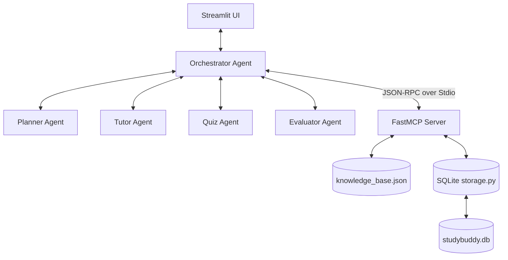

# StudyBuddy Multi-Agent Architecture

This document describes the structural design, agent roles, and data flow of **StudyBuddy**, a personalized adaptive tutoring system built on Google's Agent Development Kit (ADK) and Gemini.

---

## System Diagram

The diagram below illustrates the communication flow and separation of concerns between the Streamlit user interface, the supervisor (Orchestrator), the specialist agents, and the local Model Context Protocol (MCP) server:

---

## Agent Roles & Responsibilities

StudyBuddy uses a hierarchical coordinator-specialist pattern. The coordinator handles system state and triggers specialists, who handle specific tasks:

1. **Orchestrator Agent (Coordinator)**:
   - Manages global session state and transitions.
   - Coordinates inputs and outputs between all sub-agents.
   - Interfaces directly with the MCP server to load/save session parameters and query curriculum documents.
   - Restricts operations by executing safety checks and input sanitization first.

2. **Planner Agent (Specialist)**:
   - *Input*: Student's requested topic string (e.g. "Fractions").
   - *Output*: An ordered JSON array of 3 to 6 sub-concept strings (e.g. `["what is a fraction", "adding fractions", "multiplying fractions"]`), sorted from easiest to hardest.
   - *Model Setting*: High-structure configuration (`response_mime_type="application/json"`), low temperature to ensure formatting compliance.

3. **Tutor Agent (Specialist)**:
   - *Input*: Current subconcept, student's level, and factual grounding notes.
   - *Output*: An educational explanation containing an intuitive, real-world analogy and one worked-out example.
   - *Model Setting*: Level-dependent prompts. For beginners, it focuses on simple vocabulary and intuitive stories; for intermediate learners, it incorporates algebraic and slightly more technical depth.

4. **Quiz Agent (Specialist)**:
   - *Input*: Current subconcept, student level, and tutor explanation.
   - *Output*:
     - *Generation*: A single conceptual question testing comprehension.
     - *Grading*: A structured JSON analysis of the student's answer: `{ "correct": boolean, "explanation": string }`.

5. **Evaluator Agent (Specialist - The Adaptive Loop)**:
   - *Input*: Current student level and whether their last response was correct.
   - *Output*: JSON decision instructing the orchestrator whether to advance, repeat with a simpler explanation, or practice with a new question: `{ "action": string, "next_level": string, "reasoning": string }`.

---

## The Adaptive Loop Rationale

The heart of the adaptive tutoring system is governed by the Evaluator's rubric:

| Current Level | Quiz Result | Evaluator Action | Next Level | Educational Rationale |
| :--- | :--- | :--- | :--- | :--- |
| **Beginner** | Correct (✅) | `advance` | **Intermediate** | Student mastered the basics. Move to next subconcept and raise challenge. |
| **Beginner** | Incorrect (❌) | `repeat_same` | **Beginner** | Student struggles with foundational basics. Review current lesson and try a new practice question. |
| **Intermediate** | Correct (✅) | `advance` | **Intermediate** | Student mastered the intermediate level. Move to next subconcept. |
| **Intermediate** | Incorrect (❌) | `repeat_simpler` | **Beginner** | Concept is too challenging at intermediate level. Drop difficulty and repeat lesson with a simpler analogy. |

---

## MCP Server & Separation of Concerns

The Model Context Protocol (MCP) server decouples the agents from direct data persistence and content storage:

1. **Curriculum Lookup (`get_curriculum_content`)**:
   By keeping the academic knowledge base in a separate local JSON database read by the MCP server, the Tutor agent is grounded in facts. Instead of hallucinating definitions, the Tutor reads notes directly retrieved by the tool call.
2. **Session Persistence (`save_progress` / `load_progress`)**:
   No user PII is captured. Progress is mapped to a random session ID and serialized into a local SQLite database (`studybuddy.db`). The agents do not need direct SQLite drivers; they access the database through the standard JSON-RPC tool schemas.
